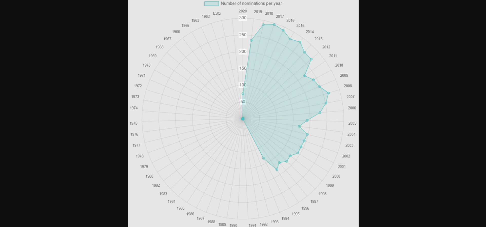

<!DOCTYPE html>
<html lang="ro">
    <head>
        <meta charset="UTF-8">
    </head>
    <body>
        <article>
            <header>
                <h1>
                    AcVis (Actors Smart Visualiser)
                </h1>
            </header>
            <h2>Cuprins</h2>
            <ul>
                <li>
                    <a href="#authors">Autori</a>
                </li>
                <li>
                    <a href="#introduction">1. Introducere</a>
                    <ul>
                        <li><a href="#introduction-purpose">1.1 Scop</a></li>
                        <li><a href="#conventions">1.2 Convenție de
                                scriere</a></li>
                        <li><a href="#audience">1.3 Publicul țintă</a></li>
                        <li><a href="#product-scope">1.4 Scopul
                                produsului</a></li>
                        <li><a href="#references">1.5 Referințe</a></li>
                    </ul>
                </li>
                <li><a href="#overall">2. Descriere Generală</a>
                    <ul>
                        <li><a href="#product-perspective">2.1 Perspectiva
                                produsului</a></li>
                        <li><a href="#product-functions">2.2 Funcțiile
                                produsului</a></li>
                        <li><a href="#users">2.3 Clase și caracteristici ale
                                utilizatorilor</a></li>
                        <li><a href="#operating-environment">2.4 Mediul de
                                operare</a></li>
                        <li><a href="#documentation">2.5 Documentația pentru
                                utilizator</a></li>
                    </ul>
                </li>
                <li><a href="#external">3. Interfețele aplicației </a>
                    <ul>
                        <li><a href="#user-interface">3.1 Interfața
                                utilizatorului </a>
                            <ul>
                                <li><a href="#nav-bar">3.1.1 Bara de navigație
                                    </a></li>
                                <li><a href="#login-page">3.1.2 Pagina de
                                        autentificare </a></li>
                                <li><a href="#home-page">3.1.3 Pagina de acasă
                                    </a></li>
                                <li><a href="#about">3.1.4 Pagina informativa
                                    </a></li>
                            </ul>
                        </li>
                        <li><a href="#hardware-interface">3.2 Interfața Hardware
                            </a></li>
                        <li><a href="#software-interface">3.3 Interfața
                                Software</a></li>
                        <li><a href="#communication-interface">3.4 Interfața de
                                comunicare</a></li>
                    </ul>
                </li>
                <li><a href="#system-features">4. Caracteristici ale
                        sistemului</a>
                    <ul>
                        <li><a href="#management">4.1 Gestionarea contului </a>
                            <ul>
                                <li><a href="#management-1">4.1.1 Descriere și
                                        generalități </a></li>
                                <li><a href="#management-2">4.1.2 Actualizarea
                                        informațiilor</a></li>
                                <li><a href="#management-3">4.1.3 Condiții de
                                        funcționare</a></li>
                            </ul>
                        </li>
                        <li><a href="#utilizatori">4.2 Secțiunea Utilizatori</a>
                            <ul>
                                <li><a href="#utilizatori-1">4.2.1 Descriere și
                                        generalități</a></li>
                                <li><a href="#utilizatori-2">4.2.2 Actualizarea
                                        informațiilor</a></li>
                                <li><a href="#utilizatori-3">4.2.3 Condiții de
                                        funcționare</a></li>
                            </ul>
                        </li>
                        <li><a href="#administrator">4.3 Secțiunea Admin</a>
                            <ul>
                                <li><a href="#administrator-1">4.3.1 Descriere
                                        și generalități</a></li>
                                <li><a href="#administrator-2">4.3.2
                                        Actualizarea informațiilor</a></li>
                                <li><a href="#administrator-3">4.3.3 Condiții de
                                        funcționare</a></li>
                            </ul>
                        </li>
                        <li><a href="#logout">4.4 Secțiunea Logout</a>
                            <ul>
                                <li><a href="#logout-1">4.4.1 Descriere și
                                        generalități</a></li>
                                <li><a href="#logout-2">4.4.2 Actualizarea
                                        informațiilor</a></li>
                                <li><a href="#logout-3">4.4.3 Condiții de
                                        funcționare</a></li>
                            </ul>
                        </li>
                        <li><a href="#other">4.5 Alte funcționalități </a>
                            <ul>
                                <li><a href="#other-1">4.5.1 Descriere și
                                        generalități</a></li>
                                <li><a href="#other-2">4.5.2 Actualizarea
                                        informațiilor</a></li>
                                <li><a href="#other-3">4.5.3 Condiții de
                                        funcționare</a></li>
                            </ul>
                        </li>
                    </ul>
                </li>
                <li><a href="#non-functional">5.Funcționalități pentru protecție
                        și securitate</a>
                    <ul>
                        <li><a href="#safety">5.1 Protecția datelor</a></li>
                        <li><a href="#security">5.2 Securizarea datelor</a></li>
                        <li><a href="#software-attributes">5.3 Calitățile
                                Software </a></li>
                    </ul>
                </li>
            </ul>
            

                <section id="authors" typeof="sa:AuthorsList">
                    <h2>Autori</h2>
                    <ul>
                        <li property="schema:author"
                            typeof="sa:ContributorRole">
                            
                                <meta content="Raluca"
                                    property="schema:givenName">
                                <meta content="Andreea"
                                    property="schema:additionalName">
                                <meta content="Bocăneț"
                                    property="schema:familyName">
                                Bocăneț
                                    Raluca-Andreea
                            
                            <ul>
                                <li property="schema:roleContactPoint"
                                    typeof="schema:ContactPoint">
                                    <a href="mailto:ralucaandreea313@gmail.com"
                                        property="schema:email">ralucaandreea313@gmail.com</a>
                                </li>
                            </ul>
                        </li>
                        <li property="schema:author"
                            typeof="sa:ContributorRole">
                            
                                <meta content="Ionela"
                                    property="schema:givenName">
                                <meta content="Elena"
                                    property="schema:additionalName">
                                <meta content="Daniela"
                                    property="schema:additionalName">
                                <meta content="Cîrjonțu"
                                    property="schema:familyName">
                                Cîrjonțu
                                    Ionela-Elena-Daniela
                            
                            <ul>
                                <li property="schema:roleContactPoint"
                                    typeof="schema:ContactPoint">
                                    <a href="mailto:ionelacirjontu7@gmail.com"
                                        property="schema:email">ionelacirjontu7@gmail.com</a>
                                </li>
                            </ul>
                        </ul>
                    </section>
                

                <section id="introduction">
                    <h3>1. Introducere</h3>
                    <section id="introduction-purpose">
                        <h4>1.1 Scop</h4>
                        

                            AcVis (Actors Smart Visualiser) este o aplicație web
                            dezvoltată de studentele menționate în secțiunea
                            de Autori de la Facultatea de
                            Informatică a Universității Alexandru Ioan Cuza.
                            Scopul acestui document este acela de a prezenta o
                            descriere detaliată a funcționalităților aplicației
                            web. Această aplicație
                            va oferi utilizatorilor posibilitatea de a vizualiza
                            informații despre actori, filme, seriale, dar și
                            despre premiile și nominalizările acestora.
                        

                    </section>
                    <section id="conventions">
                        <h4> 1.2 Convenția documentului</h4>
                        <ul>
                            <li>
                                Acest document urmează șablonul de documentație
                                a cerințelor software conform IEEE Software
                                Requirements
                                Specification.
                            </li>
                            <li>
                                Textul <b>îngroșat</b> este folosit pentru a
                                defini noțiuni personalizate sau pentru a
                                accentua
                                concepte
                                importante.
                            </li>
                        </ul>
                    </section>
                    <section id="audience">
                        <h4>1.3 Publicul țintă</h4>
                        

                            Acest document este destinat profesorilor,
                            sau studenților, însă orice
                            utilizator,
                            indiferent
                            de cunoștințele lor tehnologice,
                            poate consulta secțiunile de <b>Interfeța
                                utilizatorului</b> și <b>Caracteristici ale
                                sistemului</b>
                            pentru a
                            obține o mai bună înțelegere a ceea ce oferă
                            aplicația.
                        

                    </section>
                    <section id="product-scope">
                        <h4>1.4 Scopul Produsului</h4>
                        

                            Scopul aplicației este de a oferi utilizatorilor o
                            sursă de informații despre actori, filme, seriale,
                            dar și despre premiile și nominalizările acestora.
                            Utilizatorii nu vor primi informatii personalizate
                            in functie de istoric deoarece nu vor avea cont,
                            de fiecare data cand vor intra pe pagina vor fi
                            priviti ca utilizatori noi.
                        

                    </section>
                    <section id="references">
                        <h4>1.5 Bibliografie</h4>
                        <ul>
                            <li>Andrei Panu, Site-ul Tehnologii Web,
                                FII UAIC</li>
                            <li>H Rick. IEEE-Template - GitHub</li>
                        </ul>
                    </section>
                </section>
                <section id="overall">
                    <h3>2. Descriere Generală</h3>
                    <section id="product-perspective">
                        <h4>2.1 Perspectiva produsului</h4>
                        
AcVis (Actors Smart Visualiser) este o aplicație
                            dezvoltată în cadrul cursului de Tehnologii Web,
                            menită să
                            ofere un mod de vizualizare a informațiilor
                            despre SAG Awards din anul 1995 până în anul
                            2022.
                        </section>
                        <section id="product-functions">
                            <h4>2.2 Funcționalitățile produsului</h4>
                            Fiecare utilizator va avea acces la urmatoarele
                            funcționălități:
                            <ul>
                                <li>să consulte pagină "Home" și noutățile
                                    disponibile;</li>
                                <li>să acceseze câștigătorii ultimului an
                                    (2022) și să-și caute actorul
                                    favorit;</li>
                                <li>să acceseze prin filtrarile (filtrari dupa an si categorie) puse la
                                    dispoziție nominalizările și
                                    câștigătorii fiecărei categorii din
                                    perioada 1995-2022;</li>
                                <li>posibilitatea vizualizarii tuturor actorilor nominalizati prin apasarea butonului
                                    "See All Actors" din meniu;</li>
                                <li>să acceseze pagina "About" pentru a
                                    accesa
                                    scurtă descriere a paginii web;</li>
                                <li>dacă utilizatorul are rol de
                                    <b>admin</b>,
                                    acesta poate șterge utilizatori din baza
                                    de
                                    date;
                                </li>
                                <li>dacă utilizatorul are rol de
                                    <b>admin</b>,
                                    acesta poate modifica informații deja
                                    existente;
                                </li>
                                <li>dacă utilizatorul are rol de
                                    <b>admin</b>,
                                    acesta isi poate schimba parola prin scrierea celei vechi si introducerea cele 
                                    noi.
                                </li>
                            </ul>
                        </section>
                        <section id="users">
                            <h4>2.3 Clase și caracteristici ale
                                utilizatorilor</h4>
                            <h5>2.3.1 Utilizator principal</h5>
                            <ul>
                                <li>utilizatorii pot fi:</li>
                                <ul>
                                    <li>orice categorie de oameni care
                                        doresc să afle informații despre
                                        SAG Awards(1995-2022) și doresc
                                        să știe mai mult despre actorii
                                        preferați;
                                    </li>
                                    <li>administratorului pentru a face modificari bazei de date.</li>
                                </ul>
                            </ul>
                            <h5>2.3.2 Caracteristici</h5>
                            <ul>
                                <li>Utilizatorii pot să acceseze toate paginile
                                    aplicației web cum ar fi:
                                    <ul>
                                        <li> pagina "Home" unde poate vedea o
                                            galerie foto de la ultima ediție a
                                            premiile SAG și informații despre
                                            ultimele persoane căutate;</li>
                                        <li> pagina "About" care oferă
                                            informații despre SAG Awards;</li>
                                        <li> pagina "Login" unde se poate
                                            autentifica în contul său pentru a
                                            vizualiza și modifica conținutul ca administrator;</li>
                                        <li> prin intermediul meniului lateral,
                                            utilizatorii vor putea vizualiza
                                            informații specifice despre o
                                            anumită categorie, an sau
                                            actor. Dupa alegerea filmului sau a serialului se va deschide o pagina cu 
                                            informatii legate de nominalizarile acestuia si o imagine cu poster-ul 
                                            sau. Daca utilizatorul alege sa selecteze un actor se va deschide o 
                                            pagina cu informatii de pe wikipedia despre el, o lista cu nominalizari 
                                            extrase din baza de date, o poza cu acesta, o sectiune cu ultima stire 
                                            despre el urmata de un buton "Read more" care deschide o fila noua cu acea
                                            stire si in partea de jos se vor regasi doua tipuri de statistici cu trei
                                            feluri de export-uri generate pe baza listei de nominalizari.
                                        </li>
                                    </ul>
                                </li>
                            </li>
                        </ul>
                    </section>
                    <section id="operating-environment">
                        <h4>2.4 Mediul de operare</h4>
                        

                            Produsul dezvoltat poate fi utilizat pe
                            orice
                            dispozitiv cu un browser web care suportă
                            HTML,
                            CSS și
                            PHP.
                        

                    </section>
                    <section id="documentation">
                        <h4>2.5 Documentația pentru utilizator</h4>
                        

                            Utilizatorii pot consulta acest document
                            pentru
                            explicații detaliate despre
                            funcționalitățile
                            aplicației
                            web.
                        

                    </section>
                </section>
                <section id="external">
                    <h3>3. Interfețele aplicației</h3>
                    <section id="user-interface">
                        <h4>3.1 Interfața utilizatorului</h4>
                        Mai jos, puteți vedea o prezentare generală a
                        fiecărei pagini a aplicației și
                        funcționalităților
                        pe care le
                        oferă:
                        <ul>
                            <li id="home-page"><b> Pagina de
                                    acasă</b></li>
                            <li style="list-style: none">
                                <ul>
                                    <li>Pagina are rolul de prezența
                                        ultimele imagini de la SAG Awards și
                                        vizualizarea ultimelor persoane
                                        căutate.</li>
                                    <li class="pictures"
                                        style="list-style: none"> 
                                    </li>
                                </ul>
                            </li>
                            <li id="nav-bar"><b>Bara de
                                    navigație</b></li>
                            <li style="list-style: none">
                                <ul>
                                    <li>Aceasta reprezintă meniul de navigare
                                        către fiecare pagina a
                                        aplicației, prezent pe fiecare pagină
                                        totodată.
                                    </li>
                                    <li class="pictures"
                                        style="list-style: none"></li>
                                </ul>
                            </li>
                            <li id="login-page"><b>Pagina de
                                    autentificare</b></li>
                            <li style="list-style: none">
                                <ul>
                                    <li>Pagina are rolul de a realiza
                                        autentificarea administratorilor la
                                        AcVis.</li>
                                    <li>Pentru a se autentifica, administratorul
                                        trebuie să completeze câmpurile de
                                        "email address" și "password" cu
                                        credențiale <b>valide</b>, urmând să
                                        acționeze butonul
                                        <b>Submit</b>.
                                    </li>
                                    <li class="pictures"
                                        style="list-style: none">
                                    </li>
                                </ul>
                            </li>
                            <li id="admin-page"><b> Pagina de
                                    admin</b></li>
                            <li style="list-style: none">
                                <ul>
                                    <li>Pagina este restricționată de secțiunea de 
                                        login și oferă adminului funcționalități 
                                        precum: adăugare nominalizare nouă, 
                                        ștergere nominalizare, schimbare parolă 
                                        și vizualizare înregistrări din baza de date.
                                   </li>
                                    <li class="pictures"
                                        style="list-style: none"> 
                                    </li>
                                </ul>
                            </li>
                             <li id="admin-page"><b> Statistică pagina admin</b></li>
                            <li style="list-style: none">
                                <ul>
                                    <li>Chartul de tip radar arată numarul de 
                                        nominalizati la SAG Awards din fiecare an.
                                   </li>
                                    <li class="pictures"
                                        style="list-style: none"> 
                                    </li>
                                </ul>
                            </li>
                             <li id="admin-page"><b>Export CSV </b></li>
                            <li style="list-style: none">
                                <ul>
                                    <li>Se realizeaza prin apasarea butonului Export CSV.
                                   </li>
                                    <li class="pictures"
                                        style="list-style: none"> 
                                    </li>
                                </ul>
                            </li>
                             <li id="admin-page"><b>Export SVG</b></li>
                            <li style="list-style: none">
                                <ul>
                                    <li>Se realizeaza prin apasarea butonului Export SVG.
                                   </li>
                                    <li class="pictures"
                                        style="list-style: none"> 
                                    </li>
                                </ul>
                            </li>
                            </li>
                             <li id="admin-page"><b>Export WebP</b></li>
                            <li style="list-style: none">
                                <ul>
                                    <li>Se realizeaza prin apasarea butonului Export WebP.
                                   </li>
                                    <li class="pictures"
                                        style="list-style: none"> 
                                    </li>
                                </ul>
                            </li>
                            <li id="home-page"><b> Pagina de
                                    actor</b></li>
                            <li style="list-style: none">
                                <ul>
                                    <li>Pagina de actor are rolul de a prezenta 
                                    informatii despre actorul selectat, filmele 
                                    pentru care a fost nominalizat, 
                                    ultimele stiri despre el si vizualizarea datelor
                                    sub forma de charturi.</li>
                                    <li class="pictures"
                                        style="list-style: none"> 
                                    </li>
                                </ul>
                            </li>
                            <li id="home-page"><b>Secțiunea de stiri</b></li>
                            <li style="list-style: none">
                                <ul>
                                    <li>Stirile sunt preluate de pe un site extern pe care 
                                    te redirectioneaza butonul Read more.</li>
                                    <li class="pictures"
                                        style="list-style: none"> 
                                    </li>
                                </ul>
                            </li>
                            <li id="home-page"><b> Statistici actor</b></li>
                            <li style="list-style: none">
                                <ul>
                                    <li>Statistica de tip bar chart, cat si cea cirle chart
                                    permit vizualizarea numarului de nominalzari din fiecare an 
                                    ale actorului selectat.</li>
                                    <li class="pictures"
                                        style="list-style: none"> 
                                    </li>
                                </ul>
                            </li>
                            <li id="home-page"><b> Export bar chart</b></li>
                            <li style="list-style: none">
                                <ul>
                                    <li class="pictures"
                                        style="list-style: none"> 
                                    </li>
                                </ul>
                            </li>
                             <li id="home-page"><b> Export circle chart</b></li>
                            <li style="list-style: none">
                                <ul>
                                    <li class="pictures"
                                        style="list-style: none"> 
                                    </li>
                                </ul>
                            </li>
                            <li id="home-page"><b> Pagina de
                                    film</b></li>
                            <li style="list-style: none">
                                <ul>
                                    <li>Pagina are rolul de a prezenta
                                        premiile pentru care au fost nominalizati
                                        actorii la SAG Awards datorita performantei in
                                    filmul selectat.</li>
                                    <li class="pictures"
                                        style="list-style: none"> 
                                    </li>
                                </ul>
                            </li>
                            <li id="about"><b>Pagina
                                    informativa</b></li>
                            <li style="list-style: none">
                                <ul>
                                    <li>Pagina are rolul de a prezenta câteva
                                        informații despre SAG Awards.</li>
                                    <li class="pictures"
                                        style="list-style: none">
                                    </li>
                                </ul>
                            </li>
                        </ul>
                        <section id="hardware-interface">
                            <h4>3.2 Interfața
                                Hardware</h4>
                            

                                Acest produs nu
                                necesită
                                interfețe hardware,
                                funcționând pe orice
                                platformă
                                (calculatoare,
                                laptopuri,
                                telefoane etc.),
                                care
                                are instalat un
                                browser.
                            

                        </section>
                        <section id="software-interface">
                            <h4>3.3 Interfața
                                Software</h4>
                            

                                Cerințele minime de
                                software includ un
                                browser funcțional,
                                compatibil cu HTML,
                                CSS și
                                cu PHP. Aplicația web
                                AcVis are o interfață
                                grafică intuitivă și
                                ușor de folosit, care
                                ajută un utilizator
                                neprofesionist să
                                primească informații
                                despre actorii preferați
                                prin aplicarea mai multor
                                filtre în raport cu
                                nominalizările lor la SAG
                                AWARDS.
                            </section>
                            <section id="communication-interface">
                                <h4>3.4 Interfața de
                                    comunicare</h4>
                                

                                    Aplicația
                                    necesită o
                                    conexiune la
                                    internet.
                                    Standardul
                                    de comunicare
                                    care
                                    va fi utilizat
                                    este
                                    HTTP.
                                    Interfața de comunicare
                                    a aplicației AcVis include
                                    mai multe funcționalități care
                                    permit utilizatorilor să afle
                                    știri și informații despre
                                    actorii preferați:
                                    <ul>
                                        <li>Bara de căutare: Permite
                                            vizualizarea informațiilor după
                                            numele actorului.
                                        </li>
                                        <li>Profilurile actorilor: Când un
                                            actor este selectat din baza de
                                            date,
                                            se deschide pagina profilului său.
                                        </li>
                                        <li>Filtre de căutare: În partea stângă
                                            a paginii HOME se află un slide menu
                                            care
                                            permite filtrarea după anumite
                                            criterii
                                            ale actorilor(castigatorii din ultimul an 2020, toti actorii 
                                            nominalizati, selectii bazate pe un anumit an sau categorii).</li>
                                        <li>Secțiunea de ultimii actori
                                            căutați: Pentru vizualizarea
                                            actorilor
                                            virali în rândul utilizatorilor.
                                        </li>
                                    </ul>
                                

                            </section>
                            <section id="system-features">
                                <h3>4.
                                    Caracteristici
                                    ale
                                    sistemului</h3>
                                <section id="management">
                                    <h4>4.1
                                        Gestionarea
                                        contului</h4>
                                    <h5 id="management-1">4.1.1
                                        Descriere și
                                        generalități</h5>
                                    Un utilizator poate accesa site-ul si vizualiza informatii despre SAG Awards 
                                    creat fara a se autentifica. Singura persoana care se poate autentifica este 
                                    administratorul care are nevoie de o adresa de email si o parola pentru a accesa 
                                    pagina adminului.
                                    <h5 id="management-2">4.1.2
                                        Actualizarea
                                        informațiilor</h5>
                                    <ul>
                                        <li>
                                            Actualizarea informatiilor este realizata de catrea administrator. Acesta
                                            poate sterge sau adauga informatii despre SAG Awards si isi poate schimba 
                                            parola, toate aceste modificari fiind actualizari ale bazei de date.
                                        </li>
                                    </ul>
                                    <h5 id="management-3">4.1.3
                                        Condiții de
                                        funcționare</h5>
                                    <ul>
                                        <li>
                                            Pentru
                                            a-și
                                            modifica
                                            credențialele
                                            administratorul,
                                            trebuie
                                            să
                                            fie
                                            autentificat.
                                        </li>
                                        <li>
                                            Pentru a
                                            se
                                            autentifica,
                                            administratorul
                                            are
                                            nevoie
                                            de un
                                            cont
                                            care
                                            este
                                            înregistrat
                                            în baza
                                            de
                                            date.
                                        </li>
                                    </ul>
                                </section>
                                <section id="utilizatori">
                                    <h4>4.2
                                        Secțiunea de
                                        utilizatori</h4>
                                    <h5 id="utilizatori-1">4.2.1
                                        Descriere și
                                        generalități</h5>
                                    Secțiunea
                                    <b>Utilizatori</b>
                                    este destinată
                                    <b>adminului</b>,
                                    și
                                    aceasta îi oferă
                                    posibilitatea
                                    de a vizualiza o
                                    listă cu toti nominalizatii la premiile SAG din
                                    baza de date. De
                                    asemenea, acesta
                                    are
                                    posibilitatea
                                    de a modifica informatii despre nominalizati, dacă
                                    dorește acest
                                    lucru.
                                    <h5 id="utilizatori-2">4.2.2
                                        Actualizarea
                                        informațiilor</h5>
                                    <ul>
                                        <li>Utilizatorul nu poate modifica nimic din baza de date.</li>
                                    </ul>
                                    <h5 id="utilizatori-3">4.2.3
                                        Condiții de
                                        funcționare</h5>
                                    <ul>
                                        <li>
                                            Utilizatorul nu trebuie sa fie autentificat pentru a accesa site-ul.
                                        </li>
                                        <li> Un utilizator poate detine drepturi de admin.</li>
                                    </ul>
                                </section>
                                <section id="administrator">
                                    <h4>4.3
                                        Secțiunea
                                        Admin</h4>
                                    <h5 id="administrator-1">4.3.1
                                        Descriere și
                                        generalități</h5>
                                    Secțiunea
                                    <b>Admin</b>
                                    este
                                    destinată
                                    utilizatorilor
                                    ce au
                                    drepturi de
                                    <b>administrator</b>
                                    și
                                    această
                                    oferă facilități
                                    pe
                                    care un
                                    utilizator
                                    normal nu le
                                    are. În
                                    momentul în care
                                    adminul
                                    accesează
                                    panoul de
                                    control,
                                    va putea
                                    adaugă/modifică
                                    informatii despre nominalizarile SAG Awards.
                                    <h5 id="administrator-2">4.3.2
                                        Actualizare
                                        informațiilor</h5>
                                    <ul>
                                        <li>
                                            Pentru adaugarea unui nominalizat administratorul trebuie sa completeze 
                                            cele 6 rublici cum ar fi ID, Year, Category, Full name si Won(aici va fi 
                                            introdus true sau false daca acesta a castigat sau nu preminul). La final,
                                            dupa apasarea butonului de adaugare, o notificare cu un mesaj de succes 
                                            sau de eroare va fi afisat.
                                        </li>
                                        <li> Pentru stergerea unul nominalizat administratorul trebuie sa introduca 
                                            id-ul nominalizatului si dupa apasarea butonului de stergere va aparea o 
                                            notificare de succes sau insucces. </li>
                                        <li> Pentru schimbarea parolei, administratorul trebuie sa isi completeze     
                                            veche parola , cea noua si o confirmare a parolei noi.</li>
                                    </ul>
                                    <h5 id="administrator-3">4.3.3
                                        Condiții de
                                        funcționare</h5>
                                    <ul>
                                        <li>
                                            Utilizatorul
                                            trebuie
                                            să
                                            fie
                                            autentificat.
                                        </li>
                                        <li>
                                            Utilizatorul
                                            trebuie
                                            să
                                            dețină
                                            drepturi
                                            de
                                            admin.
                                        </li>
                                    </ul>
                                </section>
                                <section id="logout">
                                    <h4>4.4
                                        Secțiunea de
                                        Logout</h4>
                                    <h5 id="logout-1">4.4.1
                                        Descriere și
                                        generalități</h5>
                                    Secțiunea de
                                    <b>Logout</b>
                                    are
                                    rolul de a
                                    deconecta
                                    administratorul de
                                    pe
                                    cont și îl
                                    redirecționează
                                    către
                                    pagina acasă.
                                    <h5 id="logout-2">4.4.2
                                        Actualizare
                                        informațiilor</h5>
                                    <ul>
                                        <li>
                                            Odata cu apasarea butonului de logout, sesiune se va incheia.
                                        </li>
                                    </ul>
                                    <h5 id="logout-3">4.4.3
                                        Condiții de
                                        funcționare</h5>
                                    <ul>
                                        <li>
                                            Utilizatorul
                                            trebuie
                                            să
                                            fie
                                            autentificat.
                                        </li>
                                    </ul>
                                </section>
                                <section id="other">
                                    <h4>4.5 Alte
                                        funcționalități</h4>
                                    <h5 id="other-2">4.5.1
                                        Actualizarea
                                        informațiilor</h5>
                                    <ol>
                                        <li>
                                            Sectiune din pagina de Home,
                                            care ilustreaza ultimii actori
                                            vizualizati este actualizata
                                            periodic.
                                        </li>
                                    </ol>
                                    <h5 id="other-3">4.5.2
                                        Cerințe de
                                        funcționare</h5>
                                    <ul>
                                        <li>
                                            Utilizatorul nu trebuie să fie
                                            autentificat, informațiile și
                                            statisticile sunt disponibile
                                            oricărui utilizator cu o conexiune
                                            la internet și un browser compatibil
                                            cu aplicația.
                                        </li>
                                    </ul>
                                </section>
                            </section>
                            <section id="non-functional">
                                <h3>5.
                                    Funcționalități
                                    pentru protecție
                                    și
                                    securitate</h3>
                                <section id="safety">
                                    <h4>5.1
                                        Protecția
                                        datelor</h4>
                                    

                                        Aplicația va
                                        asigura
                                        confidențialitatea
                                        datelor prin
                                        intermediul
                                        unei
                                        criptări.
                                    

                                </section>
                                <section id="security">
                                    <h4>5.2
                                        Securizarea
                                        datelor</h4>
                                    

                                        Utilizatorii
                                        au
                                        acces doar
                                        la
                                        toate informatiile de pe site fara a fi autentificati.
                                        Administratorul trebuie sa fie logat pentru a modifica ceva si aceasta este o 
                                        modalitate de a pastra in siguranta datele legate de SAG Awards.
                                        Mai
                                        mult,
                                        toate
                                        datele sunt
                                        introduse
                                        in baza de
                                        date
                                        prin
                                        intermediul
                                        unor
                                        <b>prepared
                                            statements</b>,
                                        care asigura
                                        prevenirea
                                        SQL
                                        Injection.
                                    

                                </section>
                                <section id="software-attributes">
                                    <h4>5.3
                                        Calitățile
                                        Software</h4>
                                    <ul>
                                        <li>Adaptabilitate</li>
                                        <li>Ușurință
                                            în
                                            utilizare</li>
                                        <li>Flexibilitate</li>
                                    </ul>
                                </section>
                            </section>
                        </section>
                    </section>
                </article>
            </body>
        </html>
